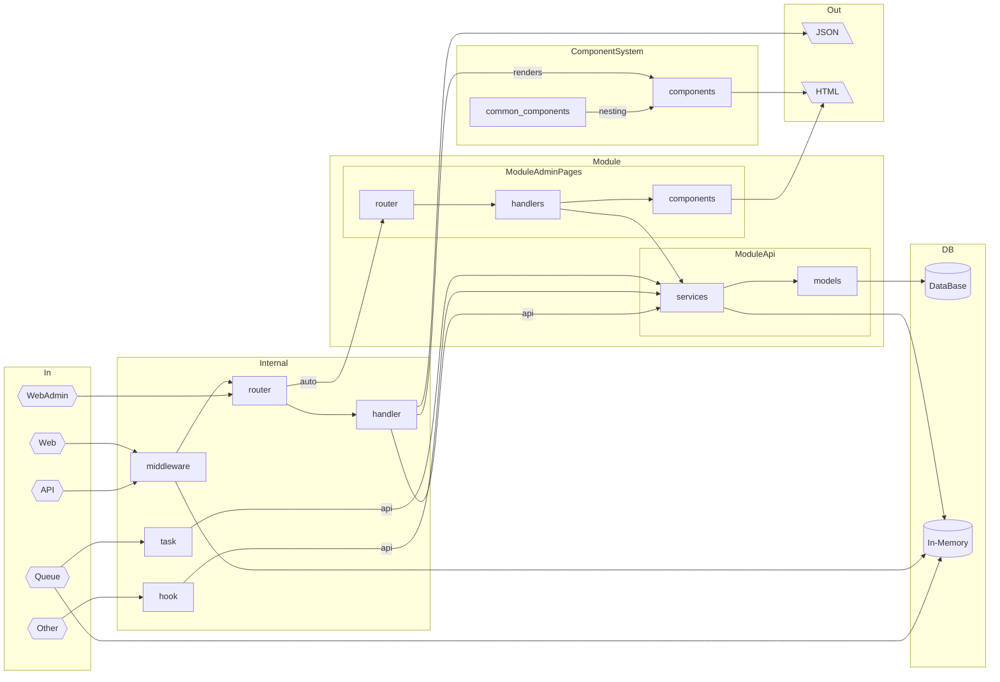

# Gothrix CMS/CMF

## В разработке!

### Цели
- единая точка входа
- слой промежуточного ПО
- компоненты для вывода данных с возможностью повторного применения
- простая "DB first" ОРМ
- расширяемость через модули
- СЕО ориентированность (SSR в комплекте)
- аутентификация/авторизация в комплекте
- кэш
- очереди задач
- электронная почта
- логирование
- готовый раздел администрирования

### Стек технологий
- [`golang`](https://go.dev/) - компилируемый многопоточный язык программирования
- [`echo`](https://echo.labstack.com/) - каркас, роутинг, слой промежуточного ПО
- [`sqlc`](https://sqlc.dev/) - простая "DB first" ОРМ, генерация типобезопасного кода из SQL
- [`templ`](https://templ.guide/) - шаблонизатор, создание HTML с помощью Go
- [`mysql`](https://www.mysql.com/) - реляционная база данных
- [`redis`](https://redis.io/) - резидентная база данных (для сессий, кэша, очередей и т.п.)
- [`htmx`](https://htmx.org/) - динамический HTML, возможность реализовать SPA+SSR на Go(обертка над AJAX)
- [`alpinejs`](https://alpinejs.dev/) - реактивный HTML, легкий JS фреймворк
- [`purecss`](https://purecss.io/) - легкий CSS каркас


### Структура проекта

```
cmd/                        Основные приложения для текущего проекта
    web/                    Web приложение
        main.php            Точка входа
    console/                Приложение консольных команд
        main.php      
components/                 Компоненты (шаблоны и представления)
    common/                 Общие компоненты (шаблоны и представления)
config/                     Файлы конфигурации
    config.php              Основной конфиг
docs/                       Документация
internal/                   Внутренний код приложения и библиотек
    hooks/                  Хуки  
    middleware/             Промежуточное ПО
        session/            Реализация сессий
    routig/                 Маршрутизация
    tasks/                  Задания для очереди задач 
modules/                    Модули
    module_name/            Исходный код модуля
        components/         Компоненты (шаблоны и представления) конкретного модуля    
        handlers/           HTTP обработчики (действия, промежуточное ПО и т. д.)
        helpers/            Вспомогательные структуры (фабрики, слушатели и т. д.)
            db/             Sql запросы для sqlc
        models/             Структуры модели предметной области (сущности, репозитории и т. д.)
        services/           Сервисный слой модуля используемый в обработчиках
        main.go             Основной файл модуля
        route.go            Файл с маршрутизацией модуля
static/                  

```



### Потенциальные модули
> **Модуль** - это блок, отвечающий за определенную функциональность, содержит API доступа к данным, бизнес-логику и события. Каждый модуль имеет метод инициализации.

#### Сайт
-   `site` - модуль сайта который использует остальные модули, если надо, для реализации сайта или свой функционал

#### Админка
-   `user` - пользователи, аутентификация
-   `admin` - настройки и т.п., зависит от user
-   `rbac` - авторизация по схеме роль-модуль-действие, зависит от user и admin


#### Контент
-   `content` - генерация сущностей page+category, если торговля - то сущности по факту это продукт + категория
-   `media` - работа с файлами, от него может зависеть модуль content
-   `seo` - метаданные страниц, от него может зависеть модуль content
-   `property` - зависит от content - заведение свойств для контентной сущности
-   `ffilter` - фильтр по свойствам, зависит от content и property, если есть price или stock, то + они
-   `comment` - комментарии, зависит от content и user


#### Торговля

-   `customer` - клиент, зависит от user
-   `wish` - зависит от content и customer
-   `compare` - зависит от content и customer
-   `price` - цена, зависит от content
-   `stock` - запас, зависит от price и content
-   `сart` - корзина, зависит от customer и price (если есть stock, то можно учитывать количество на складе)
-   `order` - заказ, зависит от customer и сart
-   `sale` - скидки у заказов, зависит от order
-   `payment` - платежные системы у заказов, зависит от order
-   `delivery` - доставки у заказов, зависит от order

